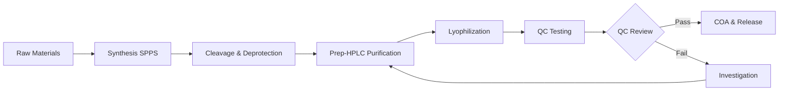

RPL Peptide

Official Technical Documentation

---

# Tirzepatide Technical Manual

| Field | Value |
|-------|-------|
| **Document Title** | Tirzepatide — Complete Technical Documentation |
| **Document ID** | RPL-TM-TIR-001 |
| **Document Type** | Complete Technical Documentation Manual |
| **Publisher** | RPL Peptide (Qingdao RPL Biotechnology Co., Ltd.) |
| **Version** | 1.0 |
| **Revision Date** | July 2026 |
| **Status** | Current |
| **Intended Audience** | Research laboratories, procurement professionals, quality assurance teams, biotechnology organizations, and scientific researchers |
| **Scope** | This manual covers the complete technical documentation for Tirzepatide (CAS: 2023788-19-2), including product specifications, analytical methods, safety data, handling protocols, quality standards, and supporting reference materials for laboratory research use. |
| **Keywords** | Tirzepatide, GIP/GLP-1 dual agonist, incretin, metabolic research peptide, synthetic peptide, GLP-1 receptor agonist, GIP receptor agonist, peptide research, laboratory reagent |
| **How to Cite This Document** | RPL Peptide. (2026). *Tirzepatide Technical Manual* (Version 1.0). RPL Peptide Official Technical Documentation. https://rplpeptides.com |

---

## Table of Contents

| Chapter | Title |
|:-------:|-------|
| 1 | Technical Data Sheet |
| 2 | Certificates of Analysis |
| 3 | Product Specifications |
| 4 | Safety Data Sheet |
| 5 | HPLC Library |
| 6 | Mass Spectra Library |
| 7 | Storage Guide |
| 8 | Solubility Guide |
| 9 | Reconstitution Guide |
| 10 | Stability Guide |
| 11 | Analytical Methods |
| 12 | Quality Standards |
| 13 | White Paper |
| 14 | Technical Bulletin |
| 15 | Application Notes |
| 16 | FAQ Library |
| 17 | Peptide Glossary |
| 18 | Documentation Policy |

---

# Chapter 1: Technical Data Sheet

Official Technical Documentation

Technical Data Sheet

---


## Product Overview

Tirzepatide is a synthetic 39-amino-acid dual receptor agonist peptide engineered to interact with both glucose-dependent insulinotropic polypeptide (GIP) and glucagon-like peptide-1 (GLP-1) receptor systems. It represents a class of multifunctional incretin receptor agonists designed for advanced metabolic research applications.

## Product Specifications

| Parameter | Specification |
|-----------|---------------|
| **Product Name** | Tirzepatide |
| **CAS Number** | 2023788-19-2 |
| **Synonyms** | Dual GIP/GLP-1 Receptor Agonist Peptide |
| **Amino Acid Count** | 39 Amino Acids |
| **Molecular Formula** | C₂₂₅H₃₄₈N₄₈O₆₈ |
| **Molecular Weight** | ~4,813 Da |
| **Peptide Type** | Synthetic Modified Peptide |
| **Classification** | Dual Incretin Receptor Agonist |
| **Appearance** | White to Off-White Lyophilized Powder |
| **Purity (HPLC)** | ≥99.0% |
| **Peptide Content** | 70–90% |
| **Water Content (KF)** | <5% |
| **Endotoxin** | <5 EU/mg |
| **Solubility** | Soluble in water, PBS, saline |
| **pH (1% Solution)** | 4.0–6.5 |
| **Storage (Lyophilized)** | -20°C (2+ years) |
| **Storage (4°C)** | 12 months |
| **Reconstituted Stability** | 2–8°C for 30 days |
| **Package Sizes** | 5 mg, 10 mg, 20 mg, 50 mg vial |
| **Certification** | COA, HPLC, LC-MS |

## Molecular Characteristics

- **Molecular Class**: Peptide-based dual GIP/GLP-1 receptor agonist
- **Structural Features**: Engineered peptide with modifications supporting multi-receptor interactions
- **Mechanism of Interest**: Coordinated activation of GIP and GLP-1 signaling pathways
- **Research Category**: Metabolic research peptides, incretin biology

## Quality Assurance

Each batch is tested using validated analytical methods:

- HPLC purity analysis at 214 nm
- LC-MS molecular weight confirmation (±0.5 Da)
- UPLC chromatographic profiling
- Water content by Karl Fischer (KF)
- Endotoxin testing (LAL method)
- Batch-specific Certificate of Analysis (COA)
- Third-party analytical validation available upon request

## Reconstitution Protocol

1. Equilibrate vial to room temperature (15–25°C).
2. Briefly centrifuge to collect powder at vial bottom.
3. Add bacteriostatic water (0.9% benzyl alcohol) against inner wall.
4. Swirl gently — DO NOT vortex or shake vigorously.
5. Clear solution = complete reconstitution.
6. Recommended concentration: 1–5 mg/mL.

## Regulatory & Disclaimer

This product is for laboratory research use only. NOT for human or veterinary consumption, medical treatment, diagnosis, or therapeutic application. All research must comply with applicable regulations.

---

# Chapter 2: Certificates of Analysis

Official Technical Documentation

Certificate of Analysis

---


> **⚠️ This document is a template for reference only. Batch-specific Certificates of Analysis (COA) with real analytical data are issued per production batch. To request a specific COA, please contact RPL Peptide staff at www.rplpeptides.com.**

## Batch Information

| Field | Details |
|-------|---------|
| **Product Name** | Tirzepatide (GIP/GLP-1 Dual Agonist) |
| **CAS Number** | 2023788-19-2 |
| **Batch Number** | [Batch Number] |
| **Manufacturing Date** | [YYYY-MM-DD] |
| **Retest Date** | [YYYY-MM-DD] |
| **Certificate Issue Date** | [YYYY-MM-DD] |
| **Lot Quantity** | [Quantity] vials |
| **Package Size** | [mg] per vial |
| **Manufacturer** | RPL Peptide (Qingdao RPL Biotechnology Co., Ltd.) |

## Analytical Results

| Test | Method | Specification | Result |
|------|--------|:------------:|:------:|
| **Appearance** | Visual Inspection | White to off-white lyophilized powder | [Result] |
| **Identification (LC-MS)** | LC-MS | Consistent with reference standard (±0.5 Da) | [Result] |
| **Purity (HPLC)** | HPLC (214 nm) | ≥99.0% | [Result] |
| **Peptide Content** | UV/Amino Acid Analysis | 70–90% | [Result] |
| **Water Content (KF)** | Karl Fischer | <5.0% | [Result] |
| **Endotoxin (LAL)** | LAL Method | <5 EU/mg | [Result] |
| **pH (1% Solution)** | pH Meter | 4.0–6.5 | [Result] |

## Chromatographic Data

| Parameter | Value |
|-----------|-------|
| **Retention Time** | [Minutes] |
| **Main Peak Purity** | [%] |
| **Impurity Profile** | [Details] |

## LC-MS Data

| Parameter | Value |
|-----------|-------|
| **Calculated Molecular Weight** | ~4,813 Da |
| **Observed Molecular Weight** | [Da] |
| **Mass Accuracy** | ±0.5 Da |

## Quality Control Status

| Review Item | Status |
|-------------|:------:|
| **QC Review** | [Approved / Rejected] |
| **Reviewed By** | [Name] |
| **Release Status** | [Released / On Hold] |

## Notes

- This certificate is generated for each batch and is part of the full traceability documentation.
- Original analytical data and chromatograms are archived and available upon request.
- Third-party analytical validation available upon request.

---

### Authorized Signature

_________________________
**[QC Manager Name]**
Quality Control Department
RPL Peptide

---

# Chapter 3: Product Specifications

Official Technical Documentation

Product Specifications

---

## General Information

| Specification | Detail |
|---------------|--------|
| **Product Name** | Tirzepatide |
| **CAS Number** | 2023788-19-2 |
| **Molecular Formula** | C₂₂₅H₃₄₈N₄₈O₆₈ |
| **Molecular Weight** | ~4,813 Da |
| **Amino Acid Count** | 39 |
| **Peptide Type** | Synthetic dual incretin receptor agonist |
| **Research Category** | Metabolic Research Peptides |

## Physical Properties

| Property | Specification |
|----------|-------------|
| **Appearance** | White to off-white lyophilized powder |
| **Odor** | Odorless or slight acetic |
| **pH (1% Solution)** | 4.0–6.5 |
| **Solubility in Water** | Soluble (≥10 mg/mL) |
| **Solubility in PBS** | Soluble (≥10 mg/mL) |
| **Solubility in Saline** | Soluble (≥10 mg/mL) |
| **Melting Point** | Decomposes >200°C |
| **Hygroscopicity** | Hygroscopic — protect from moisture |

## Purity & Quality Specifications

| Parameter | Specification | Analytical Method |
|-----------|:------------:|:-----------------:|
| **HPLC Purity** | ≥99.0% | HPLC at 214 nm |
| **Peptide Content** | 70–90% | UV / Amino Acid Analysis |
| **Water Content** | <5.0% | Karl Fischer Titration |
| **Endotoxin** | <5 EU/mg | LAL Method |
| **Counterion (TFA)** | <1.0% | HPLC / Ion Chromatography |
| **Identity** | ±0.5 Da | LC-MS |

## Packaging Specifications

| Parameter | Standard | Custom |
|-----------|:--------:|:------:|
| **Package Sizes** | 5 mg, 10 mg, 20 mg, 50 mg | Upon request |
| **Vial Material** | Type I borosilicate glass | Custom labeling available |
| **Closure** | Rubber stopper + aluminum crimp cap | OEM specifications |
| **Labeling** | Standard product label | Private label / OEM |
| **Packaging Quantity** | 10 vials per box (standard) | Bulk packaging available |

## Storage Conditions

| Condition | Duration |
|-----------|:--------:|
| **Lyophilized at -20°C** | 2+ years |
| **Lyophilized at 2–8°C** | 12 months |
| **Reconstituted at 2–8°C** | 30 days |
| **Reconstituted at Room Temperature** | 7 days |

## Shipping Specifications

| Parameter | Detail |
|-----------|--------|
| **UN Number** | Not regulated |
| **Hazard Classification** | Not classified as hazardous goods |
| **Transport Temperature** | Ambient, 2–8°C cold-chain, or -20°C dry ice |
| **Lead Time (In-Stock)** | 2 business days |
| **Lead Time (Custom Synthesis)** | 7–25 days |

## Regulatory Classification

- **GHS Classification**: Not classified as hazardous in solid form under normal handling conditions
- **Intended Use**: Laboratory research use only
- **Restrictions**: NOT for human or veterinary consumption, medical treatment, diagnosis, or therapeutic application

## Available Documentation

- Certificate of Analysis (COA)
- HPLC Chromatogram
- LC-MS Spectrum
- Material Safety Data Sheet (MSDS)
- Batch Traceability Records
- Quality Statement

---

# Chapter 4: Safety Data Sheet

Official Technical Documentation

Safety Data Sheet

---


## SECTION 1: Identification

| Field | Detail |
|-------|--------|
| **Product Name** | Tirzepatide (Lyophilized Research Peptide) |
| **Chemical Family** | Synthetic Peptide / Biochemical Research Reagent |
| **CAS Number** | 2023788-19-2 |
| **Supplier** | RPL Peptide (Qingdao RPL Biotechnology Co., Ltd.) |
| **Address** | Qingdao, Shandong Province, China |
| **Website** | www.rplpeptides.com |
| **Intended Use** | Laboratory research use only — NOT for human/veterinary consumption |

## SECTION 2: Hazards Identification

**GHS Classification:** Not classified as hazardous in solid form under normal handling conditions.

**Potential Hazards:**
- Dust/aerosol may cause respiratory irritation if inhaled
- May cause eye irritation upon direct contact
- Avoid ingestion — research compounds are not for consumption
- Lyophilized peptide may be hygroscopic — protect from moisture

## SECTION 3: Composition / Information on Ingredients

| Component | Details |
|-----------|---------|
| **Active Ingredient** | Tirzepatide (≥99.0% pure) |
| **Counterion** | Trifluoroacetic acid (TFA, CAS 76-05-1) — residual (<1%) |
| **Water** | Residual moisture (<5%) |
| **Excipients** | Mannitol or sucrose may be present (variable) |

## SECTION 4: First-Aid Measures

| Route | Procedure |
|-------|-----------|
| **Inhalation** | Move to fresh air. Seek medical attention if breathing difficulty persists. |
| **Skin Contact** | Wash with soap and water for 15 minutes. Remove contaminated clothing. |
| **Eye Contact** | Rinse with water for 15 minutes. Remove contact lenses. Seek medical attention if irritation persists. |
| **Ingestion** | Rinse mouth. Do NOT induce vomiting. Seek immediate medical attention. |

## SECTION 5: Fire-Fighting Measures

| Parameter | Detail |
|-----------|--------|
| **Suitable Extinguishing Media** | Water spray, dry chemical, CO₂, alcohol-resistant foam |
| **Thermal Decomposition Products** | CO, CO₂, NOx, HF |

## SECTION 6: Accidental Release Measures

| Aspect | Procedure |
|--------|-----------|
| **Personal Precautions** | Wear gloves, goggles, and lab coat. Avoid dust generation. |
| **Spill Cleanup** | Sweep or vacuum. Collect in sealed container. Dispose per local regulations. |

## SECTION 7: Handling and Storage

**Handling:** Use in ventilated laboratory. Wear PPE. Avoid dust generation. Wash hands after handling.

**Storage:** -20°C or 2–8°C in sealed vial. Protect from light and moisture.

## SECTION 8: Exposure Controls / Personal Protection

| Protection Type | Recommendation |
|-----------------|---------------|
| **Engineering Controls** | Local exhaust ventilation recommended |
| **Respiratory Protection** | Not required under normal use. Dust mask if aerosol possible. |
| **Hand Protection** | Nitrile or latex gloves |
| **Eye Protection** | Safety goggles |
| **Skin Protection** | Lab coat |

## SECTION 9: Physical and Chemical Properties

| Property | Value |
|----------|-------|
| **Form** | Lyophilized powder |
| **Color** | White to off-white |
| **Odor** | Odorless or slight acetic |
| **pH (1% Solution)** | 4.0–6.5 |
| **Solubility** | Water, PBS, saline |
| **Melting Point** | Decomposes >200°C |
| **Flash Point** | Not applicable |

## SECTION 10: Stability and Reactivity

| Parameter | Detail |
|-----------|--------|
| **Stability** | Stable under recommended storage conditions |
| **Incompatibility** | Strong oxidizing agents, strong acids/bases |
| **Hazardous Decomposition** | Thermal decomposition produces CO, CO₂, NOx, HF |

## SECTION 11: Toxicological Information

| Endpoint | Detail |
|----------|--------|
| **Acute Toxicity** | Limited data. Handle as potentially irritating. |
| **Skin** | May cause mild irritation |
| **Eye** | May cause mechanical irritation |
| **Respiratory** | Avoid inhalation |
| **Carcinogenicity** | Not classified |

## SECTION 12: Ecological Information

Do not release into environment. Peptides are biodegradable. TFA residual is persistent.

## SECTION 13: Disposal Considerations

Dispose according to local regulations. Incinerate at licensed facility. Do not dispose via drainage.

## SECTION 14: Transport Information

| Classification | Detail |
|----------------|--------|
| **UN Number** | Not regulated |
| **Hazard Class** | Not classified as hazardous goods |

## SECTION 15: Regulatory Information

- **GHS**: Not classified as hazardous in solid form
- **Label**: Laboratory Research Use Only

## SECTION 16: Other Information

| Field | Detail |
|-------|--------|
| **Issue Date** | July 2026 |
| **Version** | 1.0 |
| **Prepared By** | RPL Peptide Quality Department |

This SDS is for informational purposes. Users should conduct their own risk assessment.

---

# Chapter 5: HPLC Library

Official Technical Documentation

HPLC Library

---


## Analytical Method

| Parameter | Specification |
|-----------|---------------|
| **Method** | Reversed-Phase High-Performance Liquid Chromatography (RP-HPLC) |
| **Detection Wavelength** | 214 nm |
| **Column** | C18, 4.6 × 250 mm, 5 μm |
| **Mobile Phase A** | 0.1% TFA in Water |
| **Mobile Phase B** | 0.1% TFA in Acetonitrile |
| **Gradient** | Linear gradient 20–60% B over 30 minutes |
| **Flow Rate** | 1.0 mL/min |
| **Injection Volume** | 20 μL |
| **Column Temperature** | 25°C |
| **Run Time** | 40 minutes |

## Typical Chromatographic Data

| Parameter | Specification |
|-----------|:------------:|
| **Retention Time** | [Minutes] |
| **Main Peak Purity** | ≥99.0% |
| **Theoretical Plates** | ≥10,000 |
| **Tailing Factor** | 0.8–1.5 |
| **Relative Retention Time** | [RRT] |

## Acceptance Criteria

| Parameter | Limit |
|-----------|:-----:|
| **Main Peak Purity** | ≥99.0% |
| **Single Impurity** | ≤0.5% |
| **Total Impurities** | ≤1.0% |

## Representative Chromatogram

*[HPLC chromatogram image would be inserted here for each batch]*

## Batch-Specific Data

| Batch Number | Purity (%) | Retention Time (min) | Impurity Profile |
|:------------:|:----------:|:--------------------:|:----------------:|
| [Batch-001] | — | — | — |

---

## Notes

- HPLC analysis is performed on every batch prior to release
- Chromatograms are archived and available upon request
- All testing follows validated analytical procedures per ICH guidelines

---

# Chapter 6: Mass Spectra Library

Official Technical Documentation

Mass Spectra Library

---


## Analytical Method

| Parameter | Specification |
|-----------|---------------|
| **Method** | Liquid Chromatography-Mass Spectrometry (LC-MS) |
| **Ionization** | Electrospray Ionization (ESI), Positive Mode |
| **Mass Analyzer** | Quadrupole Time-of-Flight (Q-TOF) |
| **Scan Range** | m/z 500–2500 |
| **Resolution** | ≥20,000 (FWHM) |
| **Mass Accuracy** | ±0.5 Da |

## Expected Mass Data

| Parameter | Value |
|-----------|:-----:|
| **Molecular Formula** | C₂₂₅H₃₄₈N₄₈O₆₈ |
| **Calculated Average Mass** | ~4,813 Da |
| **Monoisotopic Mass** | [M+H]⁺ = ~4,814 Da |
| **Charge State Series** | [M+3H]³⁺, [M+4H]⁴⁺, [M+5H]⁵⁺, [M+6H]⁶⁺ |

## Acceptance Criteria

| Parameter | Limit |
|-----------|:-----:|
| **Mass Accuracy** | ±0.5 Da of calculated value |
| **Signal-to-Noise** | ≥10:1 for base peak |

## Representative Mass Spectrum

*[Mass spectrum image would be inserted here for each batch]*

## Typical Charge State Distribution

| Charge State | m/z (Calculated) | m/z (Observed) |
|:------------:|:-----------------:|:--------------:|
| [M+3H]³⁺ | — | — |
| [M+4H]⁴⁺ | — | — |
| [M+5H]⁵⁺ | — | — |
| [M+6H]⁶⁺ | — | — |
| [M+7H]⁷⁺ | — | — |

## Batch-Specific Data

| Batch Number | Observed Mass (Da) | Mass Accuracy (Da) | Status |
|:------------:|:------------------:|:------------------:|:------:|
| [Batch-001] | — | — | — |

---

## Notes

- Mass spectrometry confirms peptide identity and molecular integrity
- Full mass spectra archived and available upon request
- Deconvolution performed using MaxEnt or similar algorithm

---

# Chapter 7: Storage Guide

Official Technical Documentation

Storage Guide

---


## Recommended Storage Conditions

### Short-Term Storage

| Condition | Duration | Container |
|-----------|:--------:|-----------|
| **2–8°C (Refrigerated)** | Up to 12 months | Sealed, original vial |
| **-20°C (Freezer)** | 2+ years | Sealed, original vial |
| **Room Temperature (15–25°C)** | Up to 30 days | Sealed, desiccated |

### Long-Term Storage

| Condition | Duration | Container |
|-----------|:--------:|-----------|
| **-20°C (Freezer)** | 2+ years | Sealed, original vial, desiccated |
| **-80°C (Ultra-Low)** | 5+ years | Sealed, original vial |

### Reconstituted Product Storage

| Condition | Duration | Container |
|-----------|:--------:|-----------|
| **2–8°C (Refrigerated)** | Up to 30 days | Sealed, sterile vial |
| **Room Temperature** | Up to 7 days | Sealed, sterile vial |
| **-20°C (Aliquoted)** | Up to 6 months | Sterile, low-binding tubes |

## Critical Storage Rules

1. **Keep sealed** — Protect from atmospheric moisture
2. **Protect from light** — Store in original packaging or opaque container
3. **Control humidity** — Use desiccant in storage environment if possible
4. **Avoid freeze-thaw** — Repeated temperature cycling may degrade peptide
5. **Temperature stability** — Avoid prolonged exposure above 25°C

## Factors Affecting Stability

| Factor | Impact | Mitigation |
|--------|--------|------------|
| **Moisture** | Promotes hydrolysis and degradation | Desiccate; keep sealed |
| **Light** | Photo-degradation of sensitive residues | Store in dark |
| **Temperature** | Accelerated degradation at elevated temp | Maintain cold storage |
| **Oxidation** | Oxidation of methionine, cysteine residues | Inert atmosphere if possible |
| **Microbial Growth** | Contamination after reconstitution | Use sterile technique |

## Storage Do's and Don'ts

### ✅ Do
- Store in original sealed vial until use
- Allow vial to reach room temperature before opening (prevents condensation)
- Use desiccant in long-term storage
- Document storage conditions and duration
- Aliquot reconstituted peptide to avoid repeated freeze-thaw

### ❌ Don't
- Do not store near strong light sources
- Do not expose to repeated temperature fluctuations
- Do not transfer to non-sterile containers
- Do not store reconstituted peptide without proper labeling
- Do not store beyond recommended expiry date

## Temperature Monitoring

| Equipment | Recommended Action |
|-----------|-------------------|
| **Refrigerator (2–8°C)** | Daily temperature logging |
| **Freezer (-20°C)** | Weekly temperature verification |
| **Ultra-Low Freezer (-80°C)** | Weekly temperature verification |
| **Transport** | Use temperature data loggers |

---

## Storage Troubleshooting

| Issue | Possible Cause | Solution |
|-------|---------------|----------|
| Cake collapse | Moisture absorption | Discard; check seal integrity |
| Discoloration | Light exposure or oxidation | Discard; protect from light |
| Insoluble after reconstitution | Improper storage | Verify storage history |
| Reduced potency | Extended storage beyond shelf life | Use within recommended period |

---

# Chapter 8: Solubility Guide

Official Technical Documentation

Solubility Guide

---


## Solubility Profile

| Solvent | Solubility | Notes |
|---------|:----------:|-------|
| **Water** | ≥10 mg/mL | Clear solution; preferred solvent |
| **Phosphate-Buffered Saline (PBS)** | ≥10 mg/mL | Biocompatible; recommended for in vitro studies |
| **0.9% Saline** | ≥10 mg/mL | Suitable for research protocols |
| **Bacteriostatic Water (0.9% BA)** | ≥10 mg/mL | Recommended for reconstitution |
| **Dimethyl Sulfoxide (DMSO)** | ≥20 mg/mL | For stock solutions (if required) |
| **Ethanol** | Partially soluble | Limited use recommended |
| **Buffers (pH 5–7)** | ≥10 mg/mL | Optimal pH range |

## Recommended Reconstitution Solvents

### Primary Choice
**Bacteriostatic Water (0.9% Benzyl Alcohol)**
- Provides antimicrobial preservation for multi-use vials
- Recommended concentration range: 1–5 mg/mL
- Stable at 2–8°C for up to 30 days after reconstitution

### Alternative Choices
- **Sterile Water for Injection (WFI)** — For single-use preparations
- **Sterile PBS** — For biological assays requiring physiological buffer
- **0.9% Sterile Saline** — For isotonic requirements

## Optimal pH Range

| Parameter | Value |
|-----------|-------|
| **pH of 1% Solution** | 4.0–6.5 |
| **Optimal Solubility pH** | 5.0–7.0 |
| **Buffer Recommendation** | 10–50 mM phosphate buffer, pH 6.0–7.0 |

## Solubility Protocol

### Step-by-Step Reconstitution

1. **Equilibrate** — Allow sealed vial to reach room temperature (15–25°C) for 10–15 minutes
2. **Centrifuge** — Briefly spin vial (30 seconds at 3,000–5,000 rpm) to collect powder at bottom
3. **Add Solvent** — Carefully add solvent by running it down the inner wall of the vial
4. **Swirl, Don't Vortex** — Gently swirl the vial until powder is fully dissolved
5. **Inspect** — Verify clear solution with no visible particulates
6. **Concentration Check** — Confirm target concentration (recommended: 1–5 mg/mL)

### Tips for Difficult Solubility

| Issue | Solution |
|-------|----------|
| **Slow dissolution** | Allow more time; gently swirl at 5-minute intervals |
| **Clumping** | Warm vial gently in hand (body temperature only) |
| **Insoluble particles** | Centrifuge at 10,000 × g for 5 minutes; use supernatant |
| **Foaming** | Avoid vigorous shaking; use gentle inversion instead |

## Factors Affecting Solubility

| Factor | Effect | Recommendation |
|--------|--------|----------------|
| **Temperature** | Increased temp improves solubility | Warm to 25–30°C if needed |
| **pH** | Suboptimal pH reduces solubility | Maintain pH 5.0–7.0 |
| **Ionic Strength** | High salt can reduce solubility | Use low-ionic-strength buffers |
| **Concentration** | Very high concentration may cause precipitation | Keep ≤5 mg/mL for standard use |
| **Time** | Some peptides dissolve slowly | Allow 5–15 minutes with gentle agitation |

## Concentration Guidelines

| Application | Recommended Concentration |
|-------------|:------------------------:|
| **General Research** | 1–5 mg/mL |
| **In Vitro Assays** | 0.1–1 mg/mL (further diluted in medium) |
| **Stock Solutions** | 5–10 mg/mL (stable short-term) |

---

# Chapter 9: Reconstitution Guide

Official Technical Documentation

Reconstitution Guide

---


## Overview

Proper reconstitution is essential to maintain peptide integrity and ensure accurate dosing for research applications. This guide provides standardized procedures for reconstituting lyophilized Tirzepatide.

## Materials Required

- Lyophilized Tirzepatide vial
- Bacteriostatic water (0.9% benzyl alcohol) or sterile water
- Alcohol swabs (70% isopropyl)
- Sterile syringe and needle (1–3 mL recommended)
- Microcentrifuge (optional but recommended)
- Personal protective equipment (gloves, goggles, lab coat)

## Standard Reconstitution Protocol

### Step 1: Preparation
- Remove vial from storage and allow to equilibrate to room temperature (15–25°C) for 10–15 minutes
- This prevents moisture condensation on the lyophilized cake
- Clean work surface with 70% ethanol
- Sanitize hands and put on clean gloves

### Step 2: Centrifuge (Recommended)
- Briefly centrifuge the vial at 3,000–5,000 rpm for 30 seconds
- This ensures all lyophilized powder collects at the bottom of the vial
- Prevents powder loss when opening the cap

### Step 3: Vial Preparation
- Remove flip-off cap to expose rubber stopper
- Swab rubber stopper with 70% alcohol swab
- Allow alcohol to evaporate completely

### Step 4: Solvent Addition
- Draw appropriate volume of bacteriostatic water into sterile syringe
- Insert needle through rubber stopper at a slight angle
- Slowly inject solvent against the **inner glass wall** — NOT directly onto the powder
- This prevents foaming and localized high-solvent shock

### Step 5: Dissolution
- Remove syringe and needle
- **Gently swirl** the vial in a circular motion
- **DO NOT vortex or shake vigorously** — this can cause peptide aggregation
- Continue swirling until powder is fully dissolved
- Solution should appear clear and free of visible particles

### Step 6: Inspection
- Visually inspect solution against a light source
- Confirm clear solution with no cloudiness, particulates, or precipitation
- If particles remain, allow more time with gentle swirling

## Reconstitution Volume Table

| Vial Size | Target Concentration: 1 mg/mL | Target Concentration: 2 mg/mL | Target Concentration: 5 mg/mL |
|:---------:|:----------------------------:|:----------------------------:|:----------------------------:|
| **5 mg** | 5.0 mL | 2.5 mL | 1.0 mL |
| **10 mg** | 10.0 mL | 5.0 mL | 2.0 mL |
| **20 mg** | 20.0 mL | 10.0 mL | 4.0 mL |
| **50 mg** | 50.0 mL | 25.0 mL | 10.0 mL |

## Common Reconstitution Problems & Solutions

| Problem | Likely Cause | Solution |
|---------|--------------|----------|
| **Cloudy solution** | Precipitation or contamination | Discard; reconstitute fresh |
| **Visible particles** | Incomplete dissolution | Continue gentle swirling; warm hand-warm |
| **Foaming** | Too vigorous shaking | Allow foam to settle; do not vortex |
| **Gel-like consistency** | Concentration too high | Dilute further; mix gently |
| **Slow dissolution** | Cold vial | Allow longer equilibration time |

## Post-Reconstitution Handling

| Action | Guideline |
|--------|-----------|
| **Immediate Use** | Use within 2 hours if kept at room temperature |
| **Short-Term Storage** | 2–8°C for up to 30 days |
| **Aliquoting** | Divide into single-use aliquots to avoid repeated freeze-thaw |
| **Freezing Aliquots** | -20°C for up to 6 months |
| **Avoid** | Repeated freeze-thaw cycles (>3 cycles may degrade peptide) |

## Safety Notes

- Perform all work in a clean, controlled laboratory environment
- Use aseptic technique when handling sterile products
- Do not use if vial seal is broken or compromised
- Reconstituted peptide is for research use only
- Label all vials with peptide name, concentration, date, and batch number

---

# Chapter 10: Stability Guide

Official Technical Documentation

Stability Guide

---


## Stability Summary

| Form | Storage Condition | Stability Period |
|------|:----------------:|:----------------:|
| **Lyophilized** | -20°C | 2+ years |
| **Lyophilized** | 2–8°C | 12 months |
| **Lyophilized** | 25°C (Room Temp) | 30 days |
| **Reconstituted** | 2–8°C | 30 days |
| **Reconstituted** | 25°C | 7 days |
| **Reconstituted (Aliquoted)** | -20°C | 6 months |

## Stability Testing Parameters

Stability is monitored using the following analytical methods:

| Test | Method | Frequency |
|------|--------|:---------:|
| **Appearance** | Visual inspection | Each time point |
| **Purity** | HPLC (214 nm) | Each time point |
| **Identity** | LC-MS | Initial and final time points |
| **pH** | pH meter | Each time point |
| **Water Content** | Karl Fischer | Initial only |
| **Endotoxin** | LAL | Initial only |

## Accelerated Stability Data

| Condition | Duration | Expected Purity Retention |
|:---------:|:--------:|:-------------------------:|
| **40°C / 75% RH** | 2 weeks | ≥98% |
| **40°C / 75% RH** | 4 weeks | ≥97% |
| **25°C / 60% RH** | 3 months | ≥98% |
| **25°C / 60% RH** | 6 months | ≥97% |

## Degradation Pathways

| Pathway | Risk | Mitigation |
|---------|:----:|------------|
| **Hydrolysis** | Medium | Keep dry; low moisture content |
| **Oxidation** | Low-Medium | Protect from air; inert atmosphere |
| **Deamidation** | Low | Maintain pH 4.0–6.5 |
| **Aggregation** | Low | Avoid vigorous shaking; proper reconstitution |
| **Microbial Growth** | Medium (reconstituted) | Use bacteriostatic water; sterile technique |

## Stability Testing Protocol

### Real-Time Stability
- **Storage**: -20°C and 2–8°C
- **Time Points**: 0, 1, 3, 6, 12, 18, 24 months
- **Samples**: Triplicate vials per time point
- **Testing**: Appearance, purity (HPLC), identity (LC-MS), pH, moisture

### Accelerated Stability
- **Storage**: 25°C/60% RH and 40°C/75% RH
- **Time Points**: 0, 2, 4, 8, 12 weeks
- **Samples**: Triplicate vials per time point
- **Testing**: Appearance, purity (HPLC), pH

## Freeze-Thaw Stability

| Freeze-Thaw Cycles | Purity Retention |
|:------------------:|:----------------:|
| **1 cycle** | ≥99% |
| **3 cycles** | ≥98% |
| **5 cycles** | ≥97% |
| **10 cycles** | ≥95% |

> **Note**: Repeated freeze-thaw cycles are not recommended. Aliquot reconstituted peptide for single-use applications.

## Handling Effects on Stability

| Condition | Effect on Stability | Recommendation |
|-----------|:------------------:|----------------|
| **Light exposure** | Moderate degradation | Store in dark; use amber vials |
| **Temperature spikes** | Accelerated degradation | Maintain cold chain |
| **Vortexing** | Potential aggregation | Swirl gently only |
| **Dilution in buffers** | Generally stable | Use recommended buffers |
| **Metal ion contact** | Potential chelation | Use low-binding labware |

## Stability Indicators

| Indicator | Sign of Degradation |
|-----------|---------------------|
| **Visual** | Discoloration, cloudiness, precipitation |
| **HPLC** | Decreased main peak area; new impurity peaks |
| **pH** | Significant pH shift (>1.0 unit) |
| **Bioactivity** | Reduced receptor binding (functional assay) |

---

# Chapter 11: Analytical Methods

Official Technical Documentation

Analytical Methods

---


## Method Overview

| Method | Purpose | Specification |
|--------|---------|:-------------:|
| **HPLC** | Purity Analysis | ≥99.0% |
| **LC-MS** | Identity Confirmation | ±0.5 Da |
| **Karl Fischer** | Water Content | <5.0% |
| **LAL Test** | Endotoxin | <5 EU/mg |
| **UPLC** | Chromatographic Profiling | Complimentary |
| **Visual Inspection** | Appearance | White to off-white powder |

---

## 1. High-Performance Liquid Chromatography (HPLC)

### Purpose
Determination of peptide purity by reversed-phase HPLC with UV detection at 214 nm.

### Method Parameters

| Parameter | Specification |
|-----------|---------------|
| **Instrument** | HPLC system with UV/Vis detector |
| **Column** | C18, 4.6 × 250 mm, 5 μm particle size |
| **Detection** | UV at 214 nm |
| **Mobile Phase A** | 0.1% TFA in Water (v/v) |
| **Mobile Phase B** | 0.1% TFA in Acetonitrile (v/v) |
| **Gradient Program** | |
| 0–5 min | 20% B (isocratic) |
| 5–30 min | 20–60% B (linear gradient) |
| 30–35 min | 60–80% B (wash) |
| 35–40 min | 80–20% B (re-equilibration) |
| **Flow Rate** | 1.0 mL/min |
| **Injection Volume** | 20 μL (1 mg/mL solution) |
| **Column Temperature** | 25°C |
| **Run Time** | 40 minutes |

### System Suitability

| Parameter | Acceptance Criteria |
|-----------|:-------------------:|
| **Theoretical Plates** | ≥10,000 |
| **Tailing Factor** | 0.8–1.5 |
| **Resolution** | ≥2.0 (between main peak and closest impurity) |
| **% RSD (Retention Time)** | ≤1.0% (6 injections) |
| **% RSD (Peak Area)** | ≤2.0% (6 injections) |

### Calculation
Purity (%) = (Main Peak Area / Total Peak Area) × 100

---

## 2. Liquid Chromatography-Mass Spectrometry (LC-MS)

### Purpose
Confirmation of peptide identity through molecular weight determination.

### Method Parameters

| Parameter | Specification |
|-----------|---------------|
| **Instrument** | LC-MS system with ESI source |
| **Ionization Mode** | Electrospray Ionization (ESI), Positive |
| **Mass Analyzer** | Quadrupole or Q-TOF |
| **Scan Range** | m/z 500–2500 |
| **Resolution** | ≥20,000 (FWHM) |
| **Mass Accuracy** | ±0.5 Da |
| **LC Conditions** | Same as HPLC method above |

### Acceptance Criteria
- Observed mass within ±0.5 Da of theoretical monoisotopic mass
- Charge state envelope consistent with peptide molecular weight
- Deconvoluted mass matches calculated molecular weight

---

## 3. Karl Fischer (KF) Moisture Analysis

### Purpose
Determination of residual water content in lyophilized peptide.

### Method Parameters

| Parameter | Specification |
|-----------|---------------|
| **Method** | Coulometric Karl Fischer Titration |
| **Sample Size** | 5–10 mg |
| **Reagent** | Hydranal-Coulomat AG |
| **Acceptance Criteria** | <5.0% water content |

---

## 4. LAL Endotoxin Testing

### Purpose
Quantitative determination of bacterial endotoxin levels.

### Method Parameters

| Parameter | Specification |
|-----------|---------------|
| **Method** | Limulus Amebocyte Lysate (LAL) — Kinetic Turbidimetric |
| **Standard** | Control Standard Endotoxin (CSE) |
| **Acceptance Criteria** | <5 EU/mg |

---

## 5. UPLC Chromatographic Profiling

### Purpose
Complementary high-resolution chromatographic analysis.

### Method Parameters

| Parameter | Specification |
|-----------|---------------|
| **Column** | C18, 2.1 × 100 mm, 1.7 μm |
| **Detection** | UV at 214 nm and 280 nm |
| **Flow Rate** | 0.3 mL/min |
| **Run Time** | 15 minutes |

---

## 6. Visual Inspection

### Purpose
Qualitative assessment of physical appearance.

### Acceptance Criteria
- White to off-white lyophilized powder
- Free from visible contamination
- Intact cake structure

---

## Document Control

| Version | Date | Author | Changes |
|:-------:|:----:|--------|---------|
| 1.0 | July 2026 | RPL Peptide Quality | Initial release |

---

# Chapter 12: Quality Standards

Official Technical Documentation

Quality Standards

---


## Quality Policy

RPL Peptide is committed to supplying research-grade peptides that meet defined purity and quality specifications through standardized manufacturing, analytical verification, batch traceability, and continuous improvement.

## Manufacturing Standards

| Standard | Description |
|----------|-------------|
| **Peptide Synthesis** | Solid-Phase Peptide Synthesis (SPPS) under controlled protocols |
| **Batch Reproducibility** | Standardized reaction conditions for batch-to-batch consistency |
| **Purification** | Preparative HPLC purification to target purity |
| **Lyophilization** | Controlled lyophilization under defined conditions |
| **Packaging** | Clean environment packaging with quality-controlled materials |

## Analytical Specifications

| Parameter | Standard | Method |
|-----------|:--------:|--------|
| **Purity** | ≥99.0% | HPLC at 214 nm |
| **Identity** | ±0.5 Da | LC-MS |
| **Water Content** | <5.0% | Karl Fischer |
| **Endotoxin** | <5 EU/mg | LAL Test |
| **Peptide Content** | 70–90% | UV / Amino Acid Analysis |
| **Appearance** | White to off-white powder | Visual |

## Batch Traceability

Every batch has a unique lot number linking:

1. **Manufacturing Records** — Synthesis parameters, raw material lots, equipment logs
2. **Analytical Data** — HPLC chromatograms, LC-MS spectra, KF results, LAL results
3. **QC Review** — Quality control assessment and disposition decision
4. **COA Issuance** — Certificate of Analysis generation and distribution
5. **Shipment Records** — Customer, quantity, date, and shipping conditions

This ensures full lifecycle traceability from raw material through final delivery.

## Quality Control Process



### Release Criteria

A batch is released only when ALL of the following criteria are met:

- HPLC purity ≥99.0%
- LC-MS identity confirmed (±0.5 Da)
- Water content <5.0%
- Endotoxin <5 EU/mg
- Appearance conforms to specification
- Documentation complete and reviewed

## Continuous Improvement

RPL Peptide regularly reviews:

- **Quality Metrics** — Batch pass rates, purity trends, impurity profiles
- **Customer Feedback** — Quality-related communications and surveys
- **Analytical Data** — Trend analysis of key quality parameters
- **Process Improvements** — Opportunities for enhanced synthesis, purification, or testing

## Documentation Standards

| Document | Standard Content | Retention |
|----------|-----------------|:---------:|
| **Certificate of Analysis** | Results, specifications, methods | 5+ years |
| **Batch Record** | Full manufacturing history | 5+ years |
| **HPLC Chromatogram** | Full chromatographic trace | 5+ years |
| **LC-MS Spectrum** | Full mass spectrum | 5+ years |
| **Stability Data** | Time-point results | Product shelf life + 2 years |

## Third-Party Validation

- Third-party analytical validation available upon request
- Independent laboratory testing can be arranged
- Additional characterization (Amino Acid Analysis, peptide mapping) available

---

## Compliance Framework

| Area | Standard / Reference |
|------|---------------------|
| **Manufacturing** | SPPS best practices, controlled protocols |
| **Analytical** | ICH Q2(R1) Method Validation Guidelines |
| **Quality Systems** | ISO 9001 principles |
| **Safety** | GHS Classification, Lab Safety Standards |

---

# Chapter 13: White Paper

Official Technical Documentation

White Paper

---


## Abstract

Tirzepatide represents a significant advancement in engineered peptide design, incorporating dual agonism of the glucose-dependent insulinotropic polypeptide (GIP) and glucagon-like peptide-1 (GLP-1) receptors within a single molecular entity. This white paper reviews the molecular design, mechanism of action, and research applications of tirzepatide as a tool for studying incretin biology, receptor pharmacology, and metabolic signaling pathways.

## 1. Introduction

The incretin system comprises gut-derived hormones that potentiate insulin secretion in response to nutrient intake. While GLP-1 receptor agonists have been extensively characterized, the role of GIP has gained increasing attention as a complementary signaling pathway. Tirzepatide was engineered as a single peptide capable of activating both receptor systems, providing researchers with a unique molecular tool for investigating coordinated incretin signaling.

## 2. Molecular Design

### 2.1 Structural Architecture

Tirzepatide is a 39-amino-acid synthetic peptide incorporating a C20 fatty diacid moiety that enables albumin binding and extends circulating half-life. The peptide backbone contains specific amino acid substitutions designed to:

- Enhance receptor binding affinity for both GIP and GLP-1 receptors
- Improve proteolytic stability against DPP-4 degradation
- Optimize pharmacokinetic properties through albumin binding

### 2.2 Key Structural Features

| Feature | Description |
|---------|-------------|
| **Length** | 39 amino acids |
| **Modification** | C20 fatty diacid side chain |
| **Half-Life Extension** | Albumin binding via fatty acid moiety |
| **DPP-4 Resistance** | Specific amino acid substitutions at cleavage sites |

## 3. Mechanism of Action

### 3.1 Dual Receptor Activation

Tirzepatide functions as a balanced dual agonist, activating both GIP and GLP-1 receptors. This dual activation is believed to produce coordinated signaling effects that differ from single-receptor activation.

### 3.2 Signaling Pathways

Research has identified the following signaling events downstream of tirzepatide-mediated receptor activation:

1. **Adenylyl Cyclase Activation** — cAMP production via Gαs coupling
2. **PKA Pathway** — Protein kinase A phosphorylation cascades
3. **EPAC Pathway** — Exchange protein activated by cAMP signaling
4. **Calcium Signaling** — Intracellular calcium mobilization
5. **Transcriptional Regulation** — Gene expression changes

## 4. Research Applications

### 4.1 Receptor Pharmacology

Tirzepatide serves as a tool for investigating:
- Receptor selectivity and bias in GIP vs. GLP-1 activation
- Ligand-receptor binding kinetics
- Receptor internalization and recycling dynamics
- Functional selectivity (biased agonism)

### 4.2 Metabolic Signaling Studies

Researchers utilize tirzepatide to examine:
- Incretin signaling integration and cross-talk
- Nutrient sensing and metabolic regulation
- Adipose tissue and lipid metabolism
- Energy homeostasis pathways

### 4.3 Peptide Engineering

As a model compound, tirzepatide offers insights into:
- Multi-functional peptide design strategies
- Half-life extension technologies
- Peptide stability optimization
- Structure-activity relationships

### 4.4 Comparative Research

Tirzepatide is frequently studied in comparison with:
- Single GLP-1 receptor agonists
- Single GIP receptor agonists
- Other dual and triple incretin agonists
- Endogenous incretin hormones

## 5. Analytical Characterization

Comprehensive analytical characterization is essential for tirzepatide research material. Key analytical methods include:

| Method | Application |
|--------|-------------|
| **HPLC** | Purity assessment and impurity profiling |
| **LC-MS** | Identity confirmation and molecular weight verification |
| **UPLC** | High-resolution chromatographic profiling |
| **Amino Acid Analysis** | Composition verification |

## 6. Quality Considerations for Research

When sourcing tirzepatide for research applications, key quality parameters include:

- **Purity** — ≥99% by HPLC (214 nm)
- **Identity** — Confirmed by LC-MS (±0.5 Da)
- **Documentation** — Full Certificate of Analysis, batch traceability
- **Consistency** — Batch-to-batch reproducibility
- **Stability** — Demonstrated stability profile under recommended conditions

## 7. Future Directions

Ongoing areas of research interest include:

- Multi-receptor peptide design beyond dual agonism
- Tissue-specific receptor signaling patterns
- Long-term stability of engineered peptides
- Receptor signaling bias and its implications
- Novel peptide modifications for enhanced properties

## 8. Conclusion

Tirzepatide represents a significant achievement in peptide engineering and serves as a valuable research tool for investigating incretin biology, receptor pharmacology, and metabolic signaling. Its dual agonist profile provides researchers with unique opportunities to explore coordinated receptor activation and its downstream consequences.

---

## References

1. Coskun T, et al. LY3298176, a novel dual GIP and GLP-1 receptor agonist. *Mol Metab*. 2018;18:3–14.
2. Willard FS, et al. Tirzepatide is an imbalanced and biased dual GIP and GLP-1 receptor agonist. *JCI Insight*. 2020;5(17):e140532.
3. Min T, Bain SC. The role of tirzepatide in metabolic research. *Diabetes Obes Metab*. 2021;23(Suppl 3):5–16.

---

# Chapter 14: Technical Bulletin

Official Technical Documentation

Technical Bulletin

---


**Bulletin No.:** RPL-TB-TIR-001  
**Date:** July 2026  
**Subject:** Handling and Analytical Guidance for Tirzepatide Research Material

---

## 1. Product Update

This bulletin provides updated technical guidance for researchers handling tirzepatide (CAS: 2023788-19-2). Key updates include refined handling protocols and analytical characterization recommendations.

## 2. Key Updates

### 2.1 Handling Recommendations

| Area | Previous | Updated |
|------|----------|---------|
| **Equilibration** | 5 minutes | 10–15 minutes at room temperature |
| **Centrifugation** | Recommended | Strongly recommended (3,000–5,000 rpm, 30 sec) |
| **Solvent Addition** | Direct to powder | Against inner wall only |
| **Concentration Range** | 0.5–5 mg/mL | 1–5 mg/mL (optimal) |

### 2.2 Storage Update

Recent stability data supports extended storage recommendations:

| Condition | Previous | Updated |
|-----------|:--------:|:-------:|
| **-20°C (Lyophilized)** | 1 year | 2+ years |
| **2–8°C (Lyophilized)** | 6 months | 12 months |
| **2–8°C (Reconstituted)** | 14 days | 30 days |

## 3. Analytical Best Practices

### 3.1 HPLC Analysis
- Use fresh mobile phase (0.1% TFA in water/acetonitrile)
- Column conditioning: 30 minutes at initial gradient conditions
- Blank injection recommended before sample analysis
- System suitability check before each sequence

### 3.2 LC-MS Analysis
- Use positive ion mode (ESI+)
- Expected charge state series: [M+3H]³⁺ to [M+7H]⁷⁺
- Deconvolution range: m/z 800–2400 for optimal results
- External mass calibration recommended daily

## 4. Troubleshooting Common Issues

### 4.1 Low HPLC Recovery
**Symptoms**: Main peak area smaller than expected  
**Causes**:
- Insufficient sample dissolution
- Peptide adsorption to vial/syringe
- Column overload or underload

**Solutions**:
- Ensure complete dissolution (verify visually)
- Use low-binding microcentrifuge tubes
- Optimize injection volume (10–30 μL recommended)

### 4.2 Multiple Peaks in HPLC
**Symptoms**: Shoulder peaks or split peaks  
**Causes**:
- Sample aggregation
- Insufficient column equilibration
- Mobile phase degradation

**Solutions**:
- Freshly prepare sample
- Increase column equilibration time
- Prepare fresh mobile phase

### 4.3 Mass Spectrum Complexity
**Symptoms**: Unusual charge state distribution  
**Causes**:
- Salt adducts (Na⁺, K⁺)
- TFA adducts
- Sample degradation

**Solutions**:
- Desalt using C18 ZipTip or dialysis
- Use 0.1% formic acid instead of TFA for MS
- Verify sample storage conditions

## 5. Quality Advisory

All tirzepatide batches released from RPL Peptide meet the following criteria:

- ✅ HPLC Purity ≥99.0%
- ✅ LC-MS Identity Confirmed (±0.5 Da)
- ✅ Endotoxin <5 EU/mg
- ✅ Full Batch Traceability
- ✅ Certificate of Analysis Included

## 6. Contact Information

For technical inquiries regarding this bulletin:

**RPL Peptide Quality Department**  
Email: [Technical Support Email]  
Website: www.rplpeptides.com

---

**Bulletin Distribution**: All registered customers and partners  
**Next Review**: January 2027

---

# Chapter 15: Application Notes

Official Technical Documentation

Application Note

---


**Application Note No.:** RPL-AN-TIR-001  
**Date:** July 2026  
**Subject:** In Vitro Research Protocols for Tirzepatide

---

## 1. Introduction

This application note provides standardized protocols for using tirzepatide in common in vitro research applications. These protocols are intended as starting points; optimization for specific cell types and experimental conditions may be required.

## 2. Cell-Based Receptor Activation Assays

### 2.1 cAMP Accumulation Assay

#### Principle
Tirzepatide activates GIP and GLP-1 receptors coupled to Gαs, leading to intracellular cAMP accumulation. This can be quantified using commercially available cAMP detection kits.

#### Protocol

**Materials:**
- Recombinant GIPR and/or GLP-1R expressing cells
- Tirzepatide stock solution (1 mM in assay buffer)
- cAMP detection kit (e.g., HTRF, AlphaScreen, or ELISA-based)
- 384-well white assay plates
- Assay buffer: PBS + 0.1% BSA + 0.5 mM IBMX (phosphodiesterase inhibitor)

**Procedure:**

| Step | Action |
|:----:|--------|
| 1 | Seed cells at 5,000–10,000 cells/well in 384-well plate |
| 2 | Incubate overnight in serum-free medium |
| 3 | Wash cells with assay buffer |
| 4 | Add IBMX (0.5 mM final) for 15 min at 37°C |
| 5 | Prepare tirzepatide serial dilutions (10⁻¹² to 10⁻⁶ M) |
| 6 | Add tirzepatide; incubate 30 min at 37°C |
| 7 | Lyse cells and measure cAMP per kit instructions |
| 8 | Calculate EC₅₀ using nonlinear regression |

**Expected Results:**
- GLP-1R: EC₅₀ ≈ 0.5–5 nM
- GIPR: EC₅₀ ≈ 0.1–2 nM

### 2.2 Beta-Arrestin Recruitment Assay

#### Principle
Tirzepatide stimulation may recruit beta-arrestin to activated receptors, which can be measured using enzyme complementation or BRET-based assays.

#### Protocol

| Step | Action |
|:----:|--------|
| 1 | Seed PathHunter or BRET-compatible cells |
| 2 | Serum-starve for 4–6 hours |
| 3 | Add tirzepatide (10⁻¹¹ to 10⁻⁶ M) |
| 4 | Incubate 90 min at 37°C (PathHunter) or 30 min (BRET) |
| 5 | Add detection reagent (per manufacturer protocol) |
| 6 | Read luminescence or BRET ratio |
| 7 | Calculate EC₅₀ |

## 3. Binding Affinity Studies

### Radioligand Binding Assay

| Parameter | Recommendation |
|-----------|----------------|
| **Membrane Source** | GIPR or GLP-1R expressing membranes |
| **Radioligand** | [¹²⁵I]-GLP-1 or [¹²⁵I]-GIP |
| **Non-Specific Binding** | 1 μM unlabeled ligand |
| **Incubation** | 60 min at 25°C |
| **Wash** | 3× with ice-cold binding buffer |
| **Ki Calculation** | Cheng-Prusoff equation |

## 4. Insulin Secretion Assay

### 4.1 Cell Model
INS-1 832/3 cells or primary islets

### 4.2 Protocol

| Step | Action |
|:----:|--------|
| 1 | Pre-incubate cells in low-glucose (2.8 mM) KRBB buffer for 2 h |
| 2 | Wash with fresh KRBB buffer |
| 3 | Stimulate with tirzepatide (1–100 nM) + 11 mM glucose |
| 4 | Incubate 1 h at 37°C, 5% CO₂ |
| 5 | Collect supernatant |
| 6 | Measure insulin by ELISA or RIA |
| 7 | Normalize to total protein content |

## 5. Receptor Internalization Studies

### 5.1 Flow Cytometry

| Step | Action |
|:----:|--------|
| 1 | Transfect cells with receptor-GFP construct |
| 2 | Stimulate with tirzepatide (100 nM) |
| 3 | Incubate at 37°C for 0, 15, 30, 60 min |
| 4 | Acid-wash (0.2 M acetic acid, 0.5 M NaCl, pH 2.5) |
| 5 | Analyze by flow cytometry |
| 6 | Calculate % internalization (surface receptor loss) |

## 6. Data Analysis Recommendations

| Parameter | Software | Model |
|-----------|----------|-------|
| **EC₅₀ / IC₅₀** | GraphPad Prism (or equivalent) | Log(agonist) vs. response — Variable slope |
| **Binding Ki** | GraphPad Prism | One-site competitive binding |
| **Statistical Tests** | ANOVA with post-hoc test | Dunnett's or Tukey's |

## 7. Notes and Considerations

- All assays should include appropriate positive and negative controls
- Use low-binding tubes and pipette tips to minimize peptide adsorption
- Tirzepatide stocks should be prepared fresh or stored at -20°C in single-use aliquots
- DMSO concentration should not exceed 0.1% final in cell-based assays
- Each experiment should be performed in triplicate and repeated at least 3 times

---

# Chapter 16: FAQ Library

Official Technical Documentation

FAQ Library

---


## Product Information

### 1. What is tirzepatide peptide?
Tirzepatide is a synthetic 39-amino-acid dual receptor agonist peptide investigated for interactions with GIP and GLP-1 receptor systems and associated biological signaling pathways. It is a research-grade material for laboratory use only.

### 2. What is the CAS number for tirzepatide?
Tirzepatide's CAS number is **2023788-19-2**.

### 3. How is tirzepatide classified scientifically?
Tirzepatide is classified as a synthetic metabolic research peptide and a dual incretin receptor agonist peptide.

### 4. What is the molecular weight of tirzepatide?
The molecular weight of tirzepatide is approximately **~4,813 Da**.

### 5. How many amino acids does tirzepatide contain?
Tirzepatide contains **39 amino acids**.

### 6. What receptors does tirzepatide interact with?
Research indicates that tirzepatide is investigated for interactions involving both **GIP (glucose-dependent insulinotropic polypeptide)** and **GLP-1 (glucagon-like peptide-1)** receptor pathways.

### 7. What purity does RPL Peptide supply?
RPL Peptide supplies tirzepatide at **≥99.0% purity** as determined by HPLC analysis at 214 nm.

## Quality & Documentation

### 8. Do you provide a Certificate of Analysis (COA)?
Yes — every batch ships with a full COA including HPLC purity data, LC-MS identity confirmation, batch number, water content, and endotoxin results.

### 9. What analytical methods are used for quality testing?
Analytical methods include: HPLC (purity), LC-MS (identity), Karl Fischer (water content), LAL test (endotoxin), and UPLC (chromatographic profiling).

### 10. Is batch traceability documentation available?
Yes — every batch has a unique lot number linking manufacturing records, analytical data, QC review, COA issuance, and shipment records.

### 11. Can I request third-party analytical validation?
Yes — third-party analytical validation is available upon request.

## Handling & Storage

### 12. How should tirzepatide be stored?
**Lyophilized**: -20°C (2+ years) or 2–8°C (12 months). Store in sealed vial, protected from light and moisture.

**Reconstituted**: 2–8°C for up to 30 days. Aliquot to avoid freeze-thaw cycles.

### 13. What is the recommended reconstitution solvent?
**Bacteriostatic water (0.9% benzyl alcohol)** is recommended. Sterile water for injection, PBS, or 0.9% saline are also suitable alternatives.

### 14. What is the recommended concentration range?
**1–5 mg/mL** is the recommended concentration range for standard research applications.

### 15. Can I vortex tirzepatide after reconstitution?
**No** — DO NOT vortex or shake vigorously. Gently swirl until dissolved. Vortexing may cause peptide aggregation.

### 16. How long is reconstituted tirzepatide stable?
Reconstituted tirzepatide is stable for **30 days at 2–8°C** and **7 days at room temperature**.

## Supply & Procurement

### 17. What package sizes are available?
Standard sizes: **5 mg, 10 mg, 20 mg, and 50 mg** per vial. Custom sizes available upon request.

### 18. What is the minimum order quantity (MOQ)?
Standard MOQ is **1 box (10 vials)**. OEM/bulk MOQs vary by specification.

### 19. Do you offer OEM/private label services?
Yes — custom vial labeling, packaging, blend formulations, and flexible batch sizes (50–10,000+ vials per SKU).

### 20. What is the lead time?
In-stock products ship within **2 business days**. Custom synthesis: **7–25 days** depending on quantity.

### 21. How is tirzepatide shipped internationally?
Via **DHL, FedEx, or UPS** with full tracking. Options: standard ambient, cold-chain (2–8°C ice packs), or dry ice (-20°C).

### 22. What payment methods are accepted?
Bank transfer (TT), Wise, and other secure payment options.

### 23. What documentation is included with shipment?
Commercial invoice, packing list, Certificate of Analysis (COA), and Material Safety Data Sheet (MSDS).

## Research Applications

### 24. What research applications is tirzepatide used for?
Tirzepatide is used in receptor pharmacology, metabolic pathway investigation, peptide engineering studies, molecular signaling research, and comparative peptide research.

### 25. Is tirzepatide for human or veterinary use?
**No** — Tirzepatide is for **laboratory research use only**. NOT for human or veterinary consumption, medical treatment, diagnosis, or therapeutic application.

---

# Chapter 17: Peptide Glossary

Official Technical Documentation

Peptide Glossary

---


## A

**Amino Acid**
The basic building block of peptides and proteins. There are 20 standard amino acids encoded by the genetic code, each consisting of an amino group, carboxyl group, side chain, and hydrogen atom bonded to a central carbon.

**Amino Acid Analysis (AAA)**
An analytical method used to determine the amino acid composition and content of a peptide. Provides confirmation of expected composition and peptide content quantification.

**Amylin**
A 37-amino-acid peptide hormone co-secreted with insulin from pancreatic beta cells, involved in glycemic regulation.

**Analytical HPLC**
High-performance liquid chromatography used for quantitative purity assessment of peptides.

## B

**Bacteriostatic Water**
Sterile water containing 0.9% benzyl alcohol as an antimicrobial preservative, commonly used for peptide reconstitution in multi-use applications.

**Batch Traceability**
A quality system that links a unique batch number to all manufacturing records, analytical data, QC review, and shipment information for full lifecycle documentation.

**Biological Activity**
The ability of a peptide to produce a measurable effect in a biological system, such as receptor activation, enzyme inhibition, or cellular response.

## C

**cAMP (Cyclic Adenosine Monophosphate)**
A second messenger molecule produced by adenylyl cyclase in response to G protein-coupled receptor activation, commonly measured in receptor activation assays.

**Certificate of Analysis (COA)**
A document issued by quality control that summarizes the analytical test results and specifications for a specific batch of peptide.

**Cold Chain**
A temperature-controlled supply chain used to maintain product stability during storage and transportation, typically 2–8°C or -20°C.

**Counterion**
An ion associated with the peptide in the lyophilized form. Trifluoroacetic acid (TFA) is the most common counterion from HPLC purification.

## D

**Deamidation**
A chemical degradation pathway where an amide side chain is hydrolyzed to a carboxylic acid, commonly affecting asparagine and glutamine residues.

**DPP-4 (Dipeptidyl Peptidase-4)**
An enzyme that cleaves N-terminal dipeptides from peptides with proline or alanine at position 2, responsible for the degradation of incretin hormones in vivo.

**Dual Agonist**
A peptide or molecule that activates two distinct receptor systems.

## E

**EC₅₀ (Half-Maximal Effective Concentration)**
The concentration of a compound that produces 50% of its maximal effect in a concentration-response assay.

**Endotoxin**
Pyrogenic lipopolysaccharides from Gram-negative bacterial cell walls, measured by the Limulus Amebocyte Lysate (LAL) test.

**ESI (Electrospray Ionization)**
A soft ionization technique used in mass spectrometry to produce gas-phase ions from solution-phase molecules.

## G

**G Protein-Coupled Receptor (GPCR)**
A large family of cell surface receptors that signal through heterotrimeric G proteins. GIPR and GLP-1R are members of this family.

**GHRH (Growth Hormone-Releasing Hormone)**
A peptide hormone that stimulates the release of growth hormone from the pituitary gland.

**GIP (Glucose-Dependent Insulinotropic Polypeptide)**
A 42-amino-acid incretin hormone secreted by K cells in the proximal intestine that potentiates insulin secretion.

**GLP-1 (Glucagon-Like Peptide-1)**
A 30- or 31-amino-acid incretin hormone secreted by L cells in the distal intestine that potentiates insulin secretion.

## H

**HPLC (High-Performance Liquid Chromatography)**
An analytical technique used to separate, identify, and quantify components in a mixture. For peptides, commonly performed with C18 reversed-phase columns and UV detection at 214 nm.

**Hydrolysis**
Chemical degradation through reaction with water, leading to peptide bond cleavage.

## I

**ICH Guidelines**
International Council for Harmonisation guidelines for pharmaceutical quality, including method validation (Q2(R1)).

**Incretin**
A gut-derived hormone that potentiates insulin secretion in response to nutrient intake. GIP and GLP-1 are the primary incretins.

## K

**Karl Fischer (KF) Titration**
A method for quantitative determination of water content in pharmaceutical and chemical samples.

## L

**LAL Test (Limulus Amebocyte Lysate)**
A test for the detection and quantification of bacterial endotoxins.

**LC-MS (Liquid Chromatography-Mass Spectrometry)**
A hyphenated analytical technique combining liquid chromatographic separation with mass spectrometric detection for identity confirmation.

**Lyophilization**
A freeze-drying process that removes water from a frozen product under vacuum, producing a stable, dry cake.

## M

**Mass Spectrometry (MS)**
An analytical technique that measures the mass-to-charge ratio of ions to identify and quantify molecules.

**Molecular Weight (MW)**
The mass of a molecule, typically expressed in Daltons (Da) or kilodaltons (kDa).

## P

**Peptide**
A short chain of amino acids linked by peptide bonds, typically fewer than 50 amino acids in length.

**Peptide Content**
The percentage of the lyophilized powder that consists of the active peptide, excluding counterion, water, and excipients.

**Preparative HPLC**
A scaled-up chromatographic method used to purify peptides at milligram to gram quantities.

**Purity**
The percentage of the desired peptide in relation to all peptide-related components, determined by HPLC.

## R

**Reconstitution**
The process of dissolving lyophilized peptide in a suitable solvent for research use.

**Reversed-Phase HPLC**
The most common HPLC mode for peptide analysis, using a non-polar stationary phase (typically C18) and polar mobile phases.

## S

**Solid-Phase Peptide Synthesis (SPPS)**
A method for chemical synthesis of peptides where amino acids are sequentially coupled to a solid resin support.

**SPPS Cycle**
The repeated sequence of: (1) deprotection, (2) washing, (3) coupling, and (4) washing that builds the peptide chain on the solid support.

## T

**TFA (Trifluoroacetic Acid)**
A strong acid commonly used as a counterion in HPLC mobile phases and present as a residual counterion in lyophilized peptides.

## U

**UPLC (Ultra-Performance Liquid Chromatography)**
A high-resolution variant of HPLC using sub-2 μm particle columns for faster, more efficient separations.

## V

**Validation (Method)**
The process of demonstrating that an analytical method is suitable for its intended purpose, as defined by ICH Q2(R1).

---

# Chapter 18: Documentation Policy

Official Technical Documentation

Documentation Policy

---


**Policy No.:** RPL-DP-001  
**Effective Date:** July 2026  
**Version:** 1.0

---

## 1. Purpose

This policy defines the structure, content standards, revision control, and distribution guidelines for the RPL Peptide Official Technical Documentation series. It ensures that all technical documentation meets consistent quality, accuracy, and regulatory standards.

## 2. Scope

This policy applies to all official technical documentation published by RPL Peptide, including:

- Technical Data Sheets
- Certificates of Analysis (COA)
- Product Specifications
- Safety Data Sheets (SDS/MSDS)
- HPLC Library
- Mass Spectra Library
- Storage Guides
- Solubility Guides
- Reconstitution Guides
- Stability Guides
- Analytical Methods
- Quality Standards
- White Papers
- Technical Bulletins
- Application Notes
- FAQ Library
- Peptide Glossary
- Documentation Policy (this document)

## 3. Document Structure Standards

### 3.1 Header
All official technical documents must include the following header at the top of the first page:

```
Official Technical Documentation

[Document Type]
```

### 3.2 Footer
All official technical documents must include the following footer at the bottom of the last page:

```


```

### 3.3 Internal Section Headers
- **H1**: Main document title (single per document)
- **H2**: Major sections
- **H3**: Subsections
- **H4**: Detailed items

### 3.4 Product-Specific Document Naming Convention

```
tirzepatide-[document-type].md
```

**Examples:**
- `tirzepatide-technical-data-sheet.md`
- `tirzepatide-storage-guide.md`
- `tirzepatide-coa-template.md`

### 3.5 Directory Structure

```
[product-name]/
├── Technical Data Sheets/
├── Certificates of Analysis/
├── Product Specifications/
├── Safety Data Sheets/
├── HPLC Library/
├── Mass Spectra Library/
├── Storage Guides/
├── Solubility Guides/
├── Reconstitution Guides/
├── Stability Guides/
├── Analytical Methods/
├── Quality Standards/
├── White Papers/
├── Technical Bulletins/
├── Application Notes/
├── FAQ Library/
├── Peptide Glossary/
├── Documentation Policy/
└── README.md
```

## 4. Content Standards

### 4.1 Technical Data Sheets
Must include:
- Product overview
- Complete specification table
- Molecular characteristics
- Quality assurance methods
- Reconstitution protocol
- Regulatory disclaimer

### 4.2 Certificates of Analysis (COA)
Must include:
- Batch information header
- Analytical results table
- System suitability data
- QC review status
- Authorized signature block

### 4.3 Product Specifications
Must include:
- General information (name, CAS, MW)
- Physical properties
- Purity & quality specifications
- Packaging specifications
- Storage & shipping conditions
- Regulatory classification

### 4.4 Safety Data Sheets (SDS)
Must follow GHS-format with 16 sections as per international standards.

### 4.5 Guides (Storage, Solubility, Reconstitution, Stability)
Must include:
- Step-by-step procedures
- Data tables and reference values
- Troubleshooting guidance
- Best practices and common pitfalls

### 4.6 Analytical Methods
Must include:
- Method overview and purpose
- Complete method parameters
- System suitability criteria
- Calculation methods

### 4.7 Quality Standards
Must include:
- Quality policy statement
- Manufacturing standards
- Analytical specifications
- QC process flow
- Compliance framework

### 4.8 White Papers
Must include:
- Abstract
- Introduction
- Technical body with subsections
- References

### 4.9 Technical Bulletins
Must include:
- Bulletin number and date
- Clear statement of updates
- Technical details
- Distribution information

### 4.10 Application Notes
Must include:
- Step-by-step protocols
- Materials and equipment lists
- Expected results
- Data analysis guidelines

## 5. Version Control

| Element | Requirement |
|---------|-------------|
| **Version Number** | X.Y format (X = major, Y = minor) |
| **Revision History** | Table: Version, Date, Author, Changes |
| **Review Frequency** | Annually, or upon significant product/process change |
| **Archiving** | Previous versions retained for audit trail |

## 6. Document Review and Approval

| Role | Responsibility |
|------|----------------|
| **Author** | Draft document; ensure technical accuracy |
| **Technical Reviewer** | Verify content and methodology |
| **Quality Reviewer** | Ensure compliance with standards |
| **Approver** | Final sign-off for publication |

## 7. Distribution

| Document Type | Distribution |
|---------------|:------------:|
| **Technical Data Sheets** | Public — available on website |
| **COA** | Per batch — included with shipment |
| **SDS** | Available on request |
| **Guides** | Public — available on website |
| **White Papers** | Public — available on website |
| **Technical Bulletins** | Registered customers and partners |
| **Application Notes** | Public — available on website |

## 8. Document Retention

| Document Type | Retention Period |
|---------------|:----------------:|
| **COA** | 5+ years |
| **Batch Records** | 5+ years |
| **Stability Data** | Product shelf life + 2 years |
| **SDS** | Current version + 3 prior versions |
| **Quality Standards** | Current version + 1 prior version |

## 9. Quality Assurance

- All documents subject to periodic review
- Customer feedback incorporated into revision cycles
- Regulatory changes prompt immediate review
- Documents maintained in both PDF and Markdown formats

## 10. Definitions

| Term | Definition |
|------|------------|
| **Official Documentation** | Authorized technical documents published under RPL Peptide brand |
| **Batch (Lot)** | A specific quantity of material produced in a single manufacturing run |
| **COA** | Certificate of Analysis |
| **SDS** | Safety Data Sheet |
| **Revision** | A change to content that alters the document from a previous version |

---

## Document Revision History

| Version | Date | Author | Changes |
|:-------:|:----:|--------|---------|
| 1.0 | July 2026 | RPL Peptide Quality | Initial release |

---

---

© 2026 RPL Peptide

Official Technical Documentation

rplpeptides.com