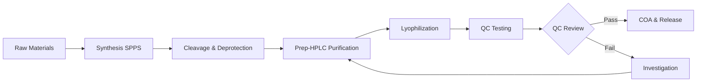

RPL Peptide

Official Technical Documentation

Quality Standards

---

# Quality Standards — Tirzepatide

## Quality Policy

RPL Peptide is committed to supplying research-grade peptides that meet defined purity and quality specifications through standardized manufacturing, analytical verification, batch traceability, and continuous improvement.

## Manufacturing Standards

| Standard | Description |
|----------|-------------|
| **Peptide Synthesis** | Solid-Phase Peptide Synthesis (SPPS) under controlled protocols |
| **Batch Reproducibility** | Standardized reaction conditions for batch-to-batch consistency |
| **Purification** | Preparative HPLC purification to target purity |
| **Lyophilization** | Controlled lyophilization under defined conditions |
| **Packaging** | Clean environment packaging with quality-controlled materials |

## Analytical Specifications

| Parameter | Standard | Method |
|-----------|:--------:|--------|
| **Purity** | ≥99.0% | HPLC at 214 nm |
| **Identity** | ±0.5 Da | LC-MS |
| **Water Content** | <5.0% | Karl Fischer |
| **Endotoxin** | <5 EU/mg | LAL Test |
| **Peptide Content** | 70–90% | UV / Amino Acid Analysis |
| **Appearance** | White to off-white powder | Visual |

## Batch Traceability

Every batch has a unique lot number linking:

1. **Manufacturing Records** — Synthesis parameters, raw material lots, equipment logs
2. **Analytical Data** — HPLC chromatograms, LC-MS spectra, KF results, LAL results
3. **QC Review** — Quality control assessment and disposition decision
4. **COA Issuance** — Certificate of Analysis generation and distribution
5. **Shipment Records** — Customer, quantity, date, and shipping conditions

This ensures full lifecycle traceability from raw material through final delivery.

## Quality Control Process

### Release Criteria

A batch is released only when ALL of the following criteria are met:

- HPLC purity ≥99.0%
- LC-MS identity confirmed (±0.5 Da)
- Water content <5.0%
- Endotoxin <5 EU/mg
- Appearance conforms to specification
- Documentation complete and reviewed

## Continuous Improvement

RPL Peptide regularly reviews:

- **Quality Metrics** — Batch pass rates, purity trends, impurity profiles
- **Customer Feedback** — Quality-related communications and surveys
- **Analytical Data** — Trend analysis of key quality parameters
- **Process Improvements** — Opportunities for enhanced synthesis, purification, or testing

## Documentation Standards

| Document | Standard Content | Retention |
|----------|-----------------|:---------:|
| **Certificate of Analysis** | Results, specifications, methods | 5+ years |
| **Batch Record** | Full manufacturing history | 5+ years |
| **HPLC Chromatogram** | Full chromatographic trace | 5+ years |
| **LC-MS Spectrum** | Full mass spectrum | 5+ years |
| **Stability Data** | Time-point results | Product shelf life + 2 years |

## Third-Party Validation

- Third-party analytical validation available upon request
- Independent laboratory testing can be arranged
- Additional characterization (Amino Acid Analysis, peptide mapping) available

---

## Compliance Framework

| Area | Standard / Reference |
|------|---------------------|
| **Manufacturing** | SPPS best practices, controlled protocols |
| **Analytical** | ICH Q2(R1) Method Validation Guidelines |
| **Quality Systems** | ISO 9001 principles |
| **Safety** | GHS Classification, Lab Safety Standards |

---

© 2026 RPL Peptide

Official Technical Documentation

rplpeptides.com
